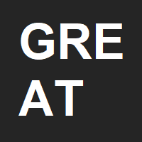

  

# GRE Argot Tester
**by Curtis Yungen**

August 2019

The GRE Argot Tester (obviously named for the acronym) is a simple web application I created to help my girlfriend study for the GRE. The program tests the user on each of the 400 hardest words commonly seen on the GRE. It allows the user to set an image and sentence for each word to aid in memorization and understanding. The user may also view hints toward the word's meaning and listen to its pronunciation. 

Check out the project here: https://vocab-cjy.herokuapp.com.

### Technologies
1) Node.js
2) Express.js
3) ReactJS
4) Speech Synthesizer API

### NPM Dependencies
1) express
2) react-dom
3) react-responsive-modal

### Download Instructions

*Ensure that you have installed a Code Editor such as Visual Studio Code as well as Node.js.
Installation instructions for Node.js can be found here: https://nodejs.org/en/download/*

1) Visit https://github.com/curtisyungen/vocab
2) Click on the green button labeled Clone or download
3) Select Download ZIP
4) Open the ZIP file and extract its contents to the desired location on your computer
5) Open Visual Studio Code or the editor of your choice
6) Open a new terminal in your code editor
7) Install all dependencies by running the command "npm install"
8) Start the program by typing the command "npm start" in your terminal
9) The program will open locally in your browser

### Screenshots

 
